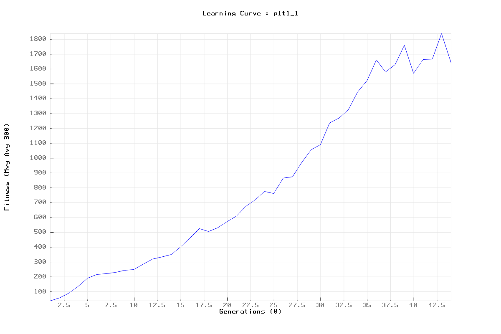
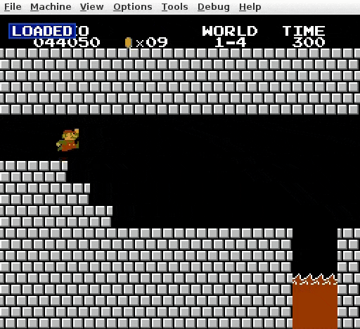

# [C++] SUPER MORIA with NEAT and TidyV3mul

- My very own NEAT framework in C++ (it's v3 on the NES) : [\[v1. BASE\]](https://github.com/romainducrocq/NEAT-TidyVolve) - [\[v2. SFML\]](https://github.com/romainducrocq/NEAT-TidyV2fml) - [\[v3. EMUL\]](https://github.com/romainducrocq/NEAT-TidyV3mul)
<!---->
  
- The NeuroEvolution of Augmenting Topologies (NEAT) User Page : http://www.cs.ucf.edu/~kstanley/neat.html
- Nintaco API - NES / Famicom emulator and game RAM manipulation in C : https://nintaco.com/api.html
<!---->
  
- AI learns to play SMB using GA and NN : https://chrispresso.io/AI_Learns_To_Play_SMB_Using_GA_And_NN
- Super Mario Bros. JU PRG0 ! ram map : https://datacrystal.romhacking.net/wiki/Super_Mario_Bros.:RAM_map
  
****

## How to _

`cd bin/`

```
1. Execute program : $ <cmd>
2. Connect Nintaco : Tools > Start Program Server... > Start Server
3. Disconnect      : Stop Server or Ctrl+C
```

### Install
`sudo ./make.sh` or  
```
OPT=$(dirname $(pwd))'/opt/'

sudo apt-get update
sudo apt-get install g++ cmake libsfml-dev valgrind libgtest-dev wmctrl

cd /usr/src/gtest
sudo cmake CMakeLists.txt
sudo make
sudo cp -v lib/*.a /usr/lib

cd "${OPT}"'java'
sudo rm -rv *
wget -O jre-8uLatest-linux-x64.tar.gz https://javadl.oracle.com/webapps/download/AutoDL?BundleId=247127_10e8cce67c7843478f41411b7003171c
tar zxvf jre-8uLatest-linux-x64.tar.gz
rm -v jre-8uLatest-linux-x64.tar.gz
mv -v jre1.8* jre1.8.0_latest

cd "${OPT}"'nintaco'
if [ -d "Nintaco_bin_2020-05-01" ]; then rm -rv Nintaco_bin_2020-05-01; fi
unzip Nintaco_bin_2020-05-01.zip
```

### Run
`sudo ./app.sh` or  
<span id="how_to_run">
```
$ ./build.sh -R
$ ./compile.sh
$ ./run.sh -m train -k n -l 1_1 -g 0 -t 0 -n 1 -p plt1_1 -s sav1_1
$ ./run.sh -m eval -k n -l 1_1 -e 10 -t 0 -n 0 -s sav1_1
```
</span>
  
[Connect Nintaco](#how-to-_)

### Train
`sudo ./train.sh [-D -R] <args>` or  
<span id="how_to_train">
```
* Debug   : $ ./train.sh -D -k n -l 1_1 -g 0 -t 0 -n 1 -p plt1_1 -s sav1_1
* Release : $ ./train.sh -R -k n -l 1_1 -g 0 -t 0 -n 1 -p plt1_1 -s sav1_1
```
</span>
  
[Connect Nintaco](#how-to-_)

### Eval
`sudo ./eval.sh [-D -R] <args>` or  
<span id="how_to_eval">
```
* Debug   : $ ./eval.sh -D -k n -l 1_1 -e 10 -t 0 -n 0 -s sav1_1
* Release : $ ./eval.sh -R -k n -l 1_1 -e 10 -t 0 -n 0 -s sav1_1
```
</span>
  
[Connect Nintaco](#how-to-_)

### Play
`sudo ./play.sh [-D -R] <args>` or  
<span id="how_to_play">
```
* Debug   : $ ./play.sh -D -k y -l 1_1 -e 10
* Release : $ ./play.sh -R -k y -l 1_1 -e 10
```
</span>
  
[Connect Nintaco](#how-to-_)

### Test
`sudo ./test.sh [-D -R] <args>` or  
<span id="how_to_test">
```
* Debug   : $ ./test.sh -D 
* Release : $ ./test.sh -R 
```
</span>
  
[Connect Nintaco](#how-to-_)

### Memcheck
`sudo ./memcheck.sh <cmd>`  
```
* Example : $ ./memcheck.sh ./train.sh -g 10 
* Example : $ ./memcheck.sh ./eval.sh -s sav
```
  
[Connect Nintaco](#how-to-_)

### Log
`sudo ./log.sh [-V] <cmd>`  
```
* Example : $ ./log.sh ./train.sh -s sav
* Example : $ ./log.sh -V ./play.sh -e 1
```
  
[Connect Nintaco](#how-to-_)

### Readme
`./readme.sh`
```
* Update : $ ./readme.sh
```

### Help
`./help.sh`  
```
usage: apps/exec [-h] [-m MOD] [-k KEY] [-l LVL] [-g GEN] [-e EPO] [-t STP] [-n NOP] [-p PLT] [-s SAV]

NEAT SuperMorIA

optional args:
  -h      Print help and exit
  -m MOD  Set mode < train | eval | play | test >
  -k KEY  Set keyboard sfml < y | n >
  -l LVL  Set load state file level lvl
  params:
  -g GEN  [train]       Set number generation (0=inf)
  -e EPO  [eval, play]  Set number epoch      (0=inf)
  -t STP  [train, eval] Set number max step   (0=inf)
  -n NOP  [train, eval] Set number max noop   (0=inf)
  utils:
  -p PLT  [train]       Set file name plot plt
  -s SAV  [train, eval] Set file name save sav
  keys:
  X       [play]        Button A      (? set)
  Z       [play]        Button B      (? set)
  Up      [play]        Button Up     (? set)
  Down    [play]        Button Down   (? set)
  Left    [play]        Button Left   (? set)
  Right   [play]        Button Right  (? set)
  Space   [play]        Button Start  (? set)
  Enter   [play]        Button Select (? set)
  D       [train, eval] (Debug) Ai view
```

### Emulation
`sudo ./emul.sh`
```
* Start : $ ./emul.sh
```

****

## Config

`include/env/conf.hpp`  
<span id="hyperparameter_values">
```
* HYPERPARAMETER VALUES :

INPUTS               = 93
OUTPUTS              = 3

LIM_HIDDEN           = 1000000

MUTATE_WEIGHT_RATE   = 0.1f
MUTATE_GENE_RATE     = 0.25f
MUTATE_LINK_RATE     = 1.f
MUTATE_BIAS_RATE     = 0.4f
MUTATE_NEURON_RATE   = 0.7f
MUTATE_ENABLE_RATE   = 0.2f
MUTATE_DISABLE_RATE  = 0.4f
MUTATE_OFFSET_SIZE   = 0.1f
MUTATE_RATE_DECAY    = 0.f

DELTA_DISJOINT       = 2.f
DELTA_WEIGHTS        = 0.4f
DELTA_THRESHOLD      = 1.f

CROSSOVER_PROB       = 0.75f
STALE_SPECIES        = 50
POPULATION_SIZE      = 300
END_POPULATION_SIZE  = 0
POPULATION_GENS_INC  = 300
POPULATION_INC_FREQ  = 10

ACT_REPEAT           = 5
MVG_AVG              = 300
PLT_FREQ             = 2
SAV_FREQ             = 1

GENERATIONS_TRAIN    = 0
EPOCHS_EVAL          = 10
MAX_STEP             = 0
MAX_NOOP             = 1
```
</span>

****

## Demo

`cd bin/ && sudo ./app.sh`

```
-------------------------------TRAIN-------------------------------
```
```
GENERATION  : 1 / 300
MAX FITNESS : 289.5
MVG AVG     : 41.0717
#   WIN     : 0

GENERATION  : 24 / 300
MAX FITNESS : 3373
MVG AVG     : 642.527
#   WIN     : 2

GENERATION  : 33 / 300
MAX FITNESS : 3375.5
MVG AVG     : 837.527
#   WIN     : 6

GENERATION  : 35 / 300
MAX FITNESS : 3402.5
MVG AVG     : 923.523
#   WIN     : 5

GENERATION  : 36 / 300
MAX FITNESS : 3440.5
MVG AVG     : 1032.61
#   WIN     : 6

GENERATION  : 44 / 300
MAX FITNESS : 3441
MVG AVG     : 1048.76
#   WIN     : 16

GENERATION  : 61 / 300
MAX FITNESS : 3443
MVG AVG     : 1773.53
#   WIN     : 83

GENERATION  : 62 / 300
MAX FITNESS : 3454
MVG AVG     : 1826.32
#   WIN     : 99

GENERATION  : 88 / 300
MAX FITNESS : 3463.5
MVG AVG     : 2168.22
#   WIN     : 140

GENERATION  : 124 / 300
MAX FITNESS : 3468.5
MVG AVG     : 2354.4
#   WIN     : 170

GENERATION  : 149 / 300
MAX FITNESS : 3470.5
MVG AVG     : 2526.36
#   WIN     : 196

GENERATION  : 155 / 300
MAX FITNESS : 3471
MVG AVG     : 2457.06
#   WIN     : 187

GENERATION  : 300 / 300
MAX FITNESS : 3471
MVG AVG     : 2749.04
#   WIN     : 216

Time: 4.03416e+08ms
```

`log/plots/`  
<span id="plot_demo1_1">
  

  
</span>
  

```
-------------------------------EVAL--------------------------------
```
```
EPOCH   : 1 / 1
FITNESS : 3471
DID WIN : YES

Time: 35091.9ms
```
- [x] **\[Overworld\]** Level 1_1: `sudo ./demo.sh 1_1`
<span id="gif_demo1_1">
  

  
</span>
  
- [x] **\[Underwater\]** Level 2_2: `sudo ./demo.sh 2_2`
<span id="gif_demo2_2">
  

  
</span>
  
- [x] **\[Castle\]** Level 1_4: `sudo ./demo.sh 1_4`
<span id="gif_demo1_4">
  

  
</span>
  
****

## Docs

### 1. Model

`include/env/env/`
`src/env/env/`
- 1.1. implement model

`res/rom/`
`res/sav/`
`res/`
- 1.2. add _rom_ file
- 1.3. add _level state_ files
- 1.4. add _optional_ resources

### 2. Control

`include/env/env.hpp`
- 2.1. add include
- 2.2. declare _model_ struct

`src/env/env.hpp`
- 2.3.  define _initialization_ function
- 2.4.  define _observation_ function
- 2.5.  define _action_ function
- 2.6.  define _is done_ function
- 2.7.  define _fitness_ function
- 2.8.  define _information_ function
- 2.9.  define _no operation_ function
- 2.10. define _reset_ function
- 2.11. define _step_ function
- 2.12. define _reset render_ function
- 2.13. define _step render_ function

### 3. View

`include/env/view.hpp`
- 3.1. add include
- 3.2. declare _event state_ struct
- 3.3. declare _draw_ variables
- 3.4. declare _draw_ functions

`src/env/view.cpp`
- 3.5. define _event setup_ function
- 3.6. define _get action_ function
- 3.7. define _draw setup_ function
- 3.8. define _draw loop_ function

### 4. Tests

`test/include/`
`test/src/`
- 4.1. implement tests

### 5. Parameters

`include/env/conf.hpp`
- 5.1. add include
- 5.2. define _default_ arguments
- 5.3. declare _optional_ parameters
- 5.4. define _argv cmds_ commands
- 5.5. define _help error_ message
- 5.6. define _optional_ commands
- 5.7. define _params_ parameters
- 5.8. define _optional_ parameters

### 6. Readme & license

`README.md`
- 6.1. update readme

`LICENSE`
- 6.2. update license

****

@romainducrocq
